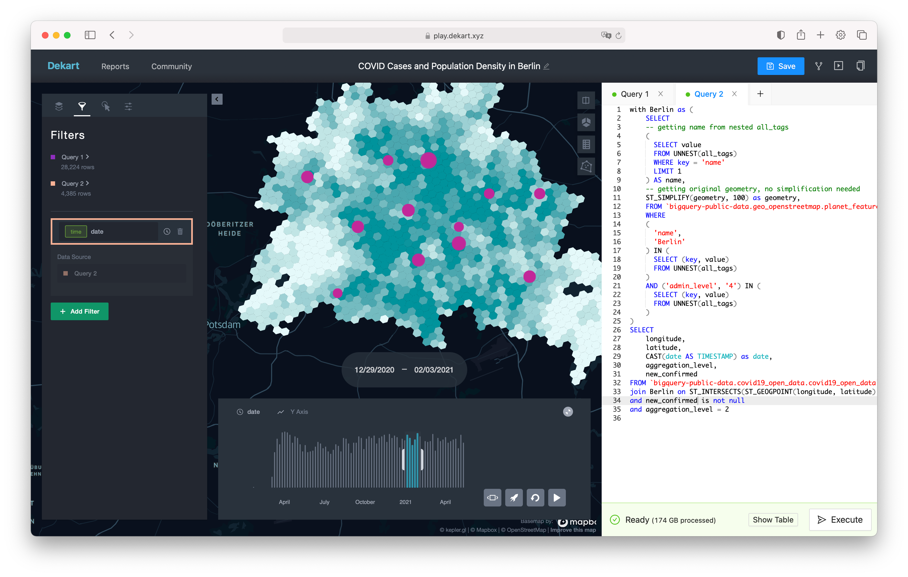

# Dekart
Dekart is open-source WebGL-powered map visualization and spatial analytics for modern data warehouses. It offers self-hosted alternative to CARTO and Foursquare Studio. We build it for data scientists, analysts, GIS professionals, and developers who need to visualize large datasets on a map.

<a href="https://dekart.xyz/docs/about/playground/?ref=github">Try Dekart with BigQuery Open Datasets</a>

## Features

Create beautiful data-driven maps and share them with your team:

* State-of-the art WebGL-powered map visualization for Snowflake, BigQuery and Amazon Athena
* Optimized for large query results, tested 100Mb/1M rows
* Efficient query result caching on Amazon S3 or Google Cloud Storage
* Side-by-side SQL editor and support for CSV and GeoJSON file uploads
* Simple Docker-based deployment with native support for Amazon Cognito and Google IAP and AWS/GCP/Terraform examples

## Available data sources

* Snowflake ❄️
* BigQuery
* AWS Athena
* CSV (file upload)
* GeoJSON (file upload)

## Self-hosting Dekart

* [Deploy to AWS/ECS with Terraform](https://dekart.xyz/docs/self-hosting/aws-ecs-terraform/?ref=github)  and manage access with Google IAP
* [Deploy to Google App Engine](https://dekart.xyz/docs/self-hosting/app-engine/?ref=github)  and manage access with Google IAP
* [Run with Docker](https://dekart.xyz/docs/self-hosting/docker/?ref=github)
* [Documentation](https://dekart.xyz/docs/configuration/environment-variables/?ref=github)

## Support us building Dekart

* Give it ⭐️ on GitHub!
* Be part of the conversation in the [Dekart Community Slack](https://bit.ly/dekart-slack)
* Vote for new features by adding 👍 to items in the [Public Road map](https://github.com/dekart-xyz/dekart/projects/1).
* Raise issues and feature requests in [Dekart GitHub Issues](https://github.com/dekart-xyz/dekart/issues/new/choose)

## Contributing

* [Build from source](https://dekart.xyz/docs/contributing/build-from-source/?ref=github)
* [Architecture Diagram](https://dekart.xyz/docs/contributing/architecture-overview/?ref=github)
* [Contribution Guide](./CONTRIBUTING.md)

## Name origin

Dekart is named after French mathematician René Descartes (French: [ʁəne dekaʁt], Latinized: Renatus Cartesius). Descartes was the name of a French family surname derived from the word des chartes, meaning "of the charts"; this was a reference to the family's involvement in the creation of maps and globes.

## License

MIT
