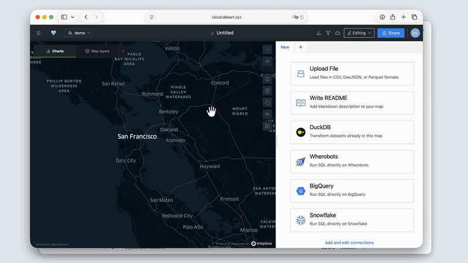

<div align="center">
  <h1 align="center">Dekart</h1>
  <h3>Open-source alternative to <a href="https://carto.com">CARTO</a></h3>
   <div><code>Connectors: Postgres, BigQuery, Snowflake, Wherobots and DuckDB</code></div>
</div>

<br/>

<p align="center"><a href="https://cloud.dekart.xyz/reports/da0fc606-9921-4ca3-9b51-bb41e2693e58/source?ref=github-pic"></a></p>
<div align="center">
  <a href="https://cloud.dekart.xyz/reports/da0fc606-9921-4ca3-9b51-bb41e2693e58/source?ref=github-try-live-demo"></a>
</div>

## Quick Start

```sh
docker run -p 8080:8080 dekartxyz/dekart
```

[Deployment Options](https://dekart.xyz/docs/self-hosting/docker/?ref=github)

### Optional: install Claude/Codex skill

```sh
pip install geosql && geosql
```

Then ask Claude or Codex to build a map from your data.

## Map Examples

[BigQuery](https://dekart.xyz/docs/about/overture-maps-examples/)
| [Snowflake](https://dekart.xyz/docs/about/snowflake-kepler-gl-examples/)
| [Wherobots](https://dekart.xyz/docs/usage/wherobots-sql-tutorial/)


## Features

* Connect to Postgres, BigQuery, Snowflake, Wherobots, DuckDB and more
* Create live maps dashboards with SQL or Claude and Codex agents
* Multiple layers, H3, interactive charts, query parameters
* WebGL maps, responsive at 1M points
* Share private maps with links
* SSO: Google OAuth, Keycloak, AWS Cognito, Google IAP

## How it works

Dekart is a self-hosted single Docker application, built with Golang and React. It connects to your data warehouse and exposes MCP, enabling agents to create maps and improve accuracy on geospatial tasks.

## Documentation

Dekart is a single Docker container that can be deployed to any cloud provider or on-premises server. By default it uses built-in SQLite for metadata and local file storage, so it can run with zero configuration. For production deployments, you can configure S3/GCS backups or a Postgres metadata backend.

* [Quick Start](https://dekart.xyz/docs/self-hosting/docker/?ref=github)
* [Environment Variables](https://dekart.xyz/docs/configuration/environment-variables/)

### Deployment Guides:

- [Run with Docker](https://dekart.xyz/docs/self-hosting/docker/?ref=github)
- [Run with Docker Compose profiles](https://dekart.xyz/docs/self-hosting/docker-compose/?ref=github)
- [Keycloak + Postgres reverse proxy example](https://dekart.xyz/docs/self-hosting/keycloak-reverse-proxy/?ref=github)
- [Docker Compose examples by setup](install/docker-compose/README.md)
- [Deploy to AWS/ECS (Terraform)](https://dekart.xyz/docs/self-hosting/aws-ecs-terraform/?ref=github)
- [Deploy to Google App Engine](https://dekart.xyz/docs/self-hosting/app-engine/?ref=github)
- [Enable SSO for self-hosted instance](https://dekart.xyz/docs/self-hosting/enable-sso-open-source-instance/?ref=github)

⭐️ Press GitHub Star to get notified of updates.

## Support

[Slack Community](https://slack.dekart.xyz)

## License

This project is open source under the GNU Affero General Public License Version 3 (AGPLv3) or any later version.

Copyright (c) 2026 Volodymyr Bilonenko
