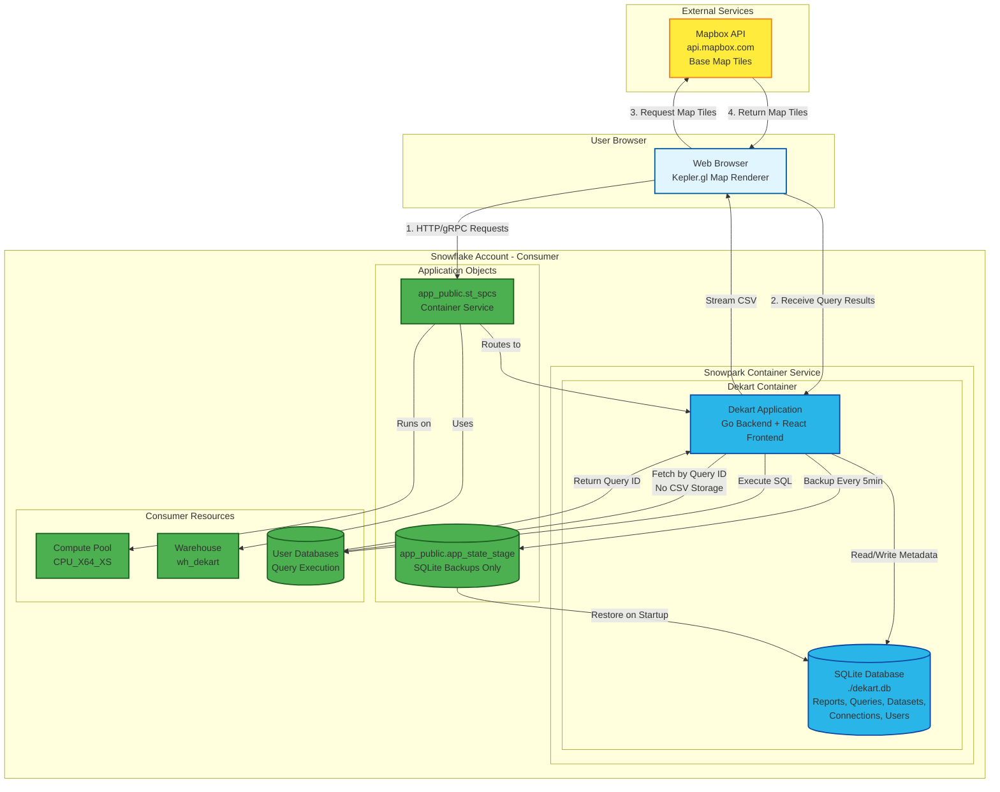
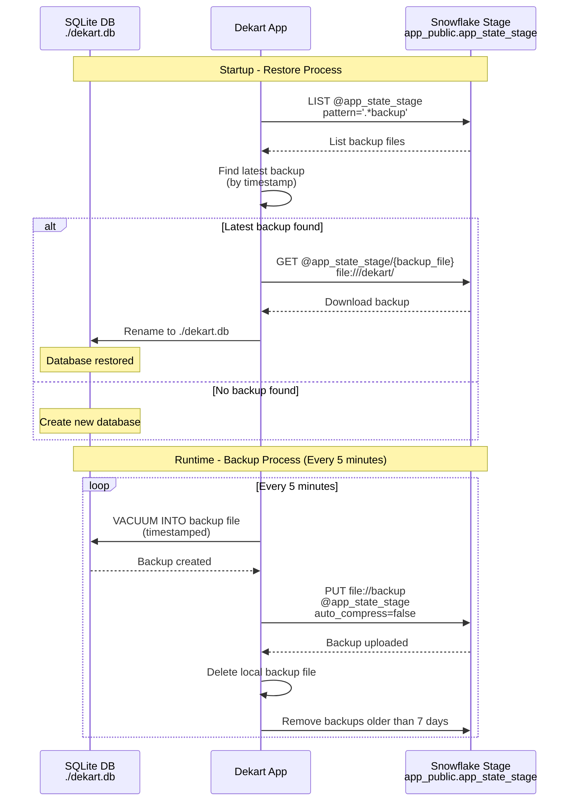
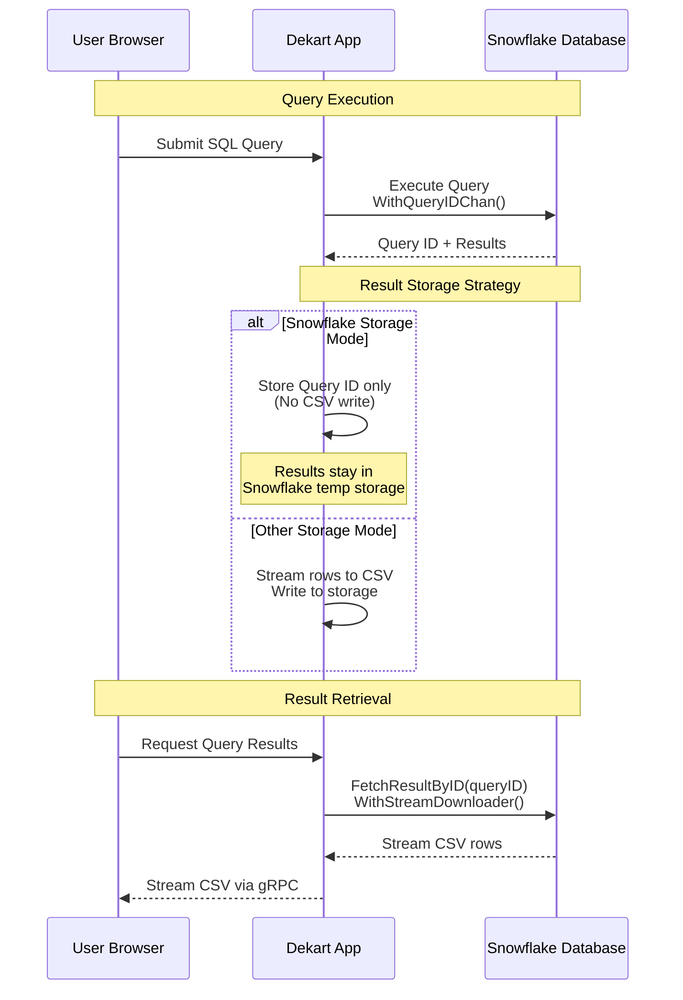
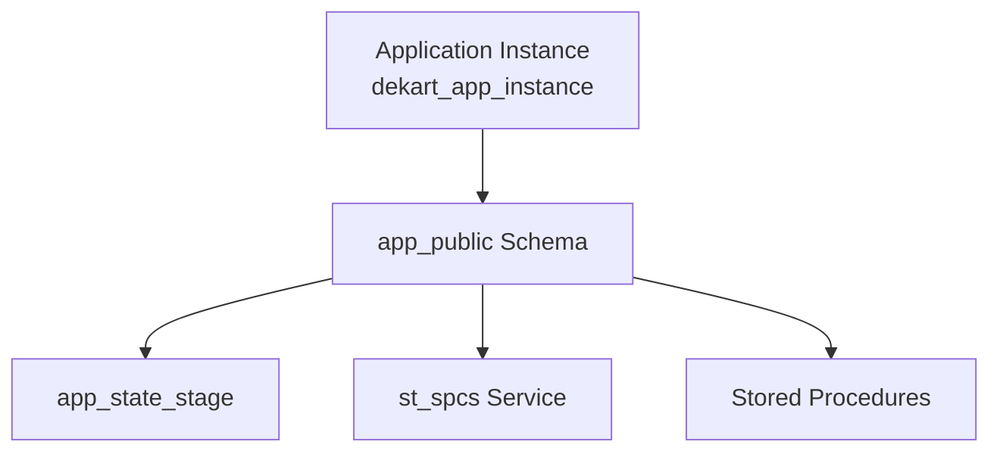
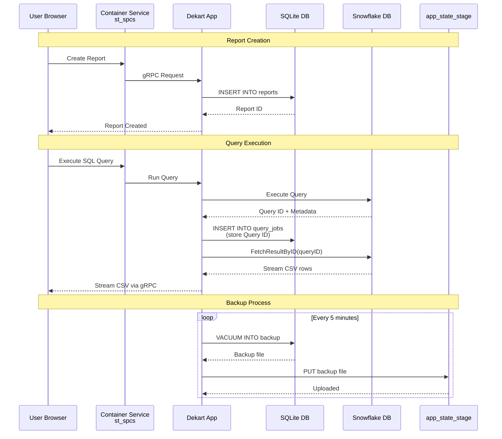

# Dekart Snowpark Architecture

## System Architecture

## SQLite Workflow

### Purpose
SQLite stores all application metadata:
- **Reports**: Map configurations, titles, descriptions
- **Queries**: SQL text, parameters, job status
- **Datasets**: Links between queries/files and reports
- **Connections**: Data source configurations
- **Users**: User permissions and settings

### Backup & Restore Process

### Key Configuration

- **Database Path**: `DEKART_SQLITE_DB_PATH=./dekart.db`
- **Stage Location**: `DEKART_SNOWFLAKE_STAGE=app_public.app_state_stage`
- **Backup Frequency**: `DEKART_BACKUP_FREQUENCY_MIN=5` (default: 5 minutes)
- **Backup Retention**: `DEKART_MAX_BACKUPS_AGE_DAYS=7` (default: 7 days)

### Backup File Format
- **Pattern**: `dekart.db_YYYYMMDD_HHMMSS.backup`
- **Storage**: Snowflake Stage (not in container filesystem)
- **Method**: SQLite `VACUUM INTO` command (creates clean copy)

## Snowflake Result Serving

### Efficient Query Result Storage

When `DEKART_STORAGE=SNOWFLAKE`, query results are **NOT** written to CSV files in a stage. Instead:

### Benefits of Snowflake Storage Mode

1. **No Duplication**: Results stay in Snowflake's temporary result storage
2. **No Stage I/O**: No need to write/read CSV files
3. **Automatic Cleanup**: Snowflake manages result expiration
4. **Efficient Streaming**: Direct fetch by Query ID with streaming

### Implementation Details

- **Storage Object**: `SnowflakeStorageObject` (stores Query ID only)
- **Reader**: Uses `WithFetchResultByID()` and `WithStreamDownloader()`
- **Expiration**: Snowflake automatically expires results (error 612)
- **Code Reference**: `src/server/storage/snowflakestorage.go`

## Snowpark Entities

### Application Instance (Consumer Account)

**Created Objects**:
- **Application Instance**: `dekart_app_instance` (installed from package)
- **Schema**: `app_public` (application-owned schema)
- **Stage**: `app_public.app_state_stage` (for SQLite backups)
- **Service**: `app_public.st_spcs` (container service)
- **Procedures**: `v1.start_service()`, `v1.init()`, etc.

### Consumer Resources

**Compute Pool**:
- **Name**: `service_compute_pool` (or custom)
- **Size**: `CPU_X64_XS` (minimum)
- **Nodes**: `MIN_NODES=1, MAX_NODES=1`
- **Purpose**: Runs Dekart container

**Warehouse**:
- **Name**: `wh_dekart` (or custom)
- **Size**: `XSMALL`
- **Purpose**: Executes SQL queries and manages stage operations

**External Access Integration**:
- **Name**: `MAPBOX_EAI` (optional, for map tiles)
- **Network Rule**: Allows egress to `api.mapbox.com`
- **Purpose**: Enables Mapbox API access from container

### Application Roles

- **`app_admin`**: Full access (backup/restore, service management)
- **`app_user`**: Read access (view reports, execute queries)

### Service Endpoints

- **Service**: `app_public.st_spcs`
- **Endpoint**: `app` (port 8080)
- **Public**: Yes (accessible via Snowflake-provided URL)

## Complete Data Flow

## Key Configuration Variables

| Variable | Purpose | Example |
|----------|---------|---------|
| `DEKART_STORAGE` | Storage backend | `SNOWFLAKE` |
| `DEKART_DATASOURCE` | Data source type | `SNOWFLAKE` |
| `DEKART_SQLITE_DB_PATH` | SQLite file path | `./dekart.db` |
| `DEKART_SNOWFLAKE_STAGE` | Backup stage location | `app_public.app_state_stage` |
| `DEKART_BACKUP_FREQUENCY_MIN` | Backup interval | `5` |
| `DEKART_REQUIRE_SNOWFLAKE_CONTEXT` | Enforce Snowflake auth | `1` |

## Map Provider Note

**Mapbox** (optional):
- **Token**: `DEKART_MAPBOX_TOKEN` (required for base maps)
- **Usage**: Base map tiles only (no user data transmitted)
- **Alternative**: "No-basemap" option available
- **Network**: Requires External Access Integration for `api.mapbox.com`

