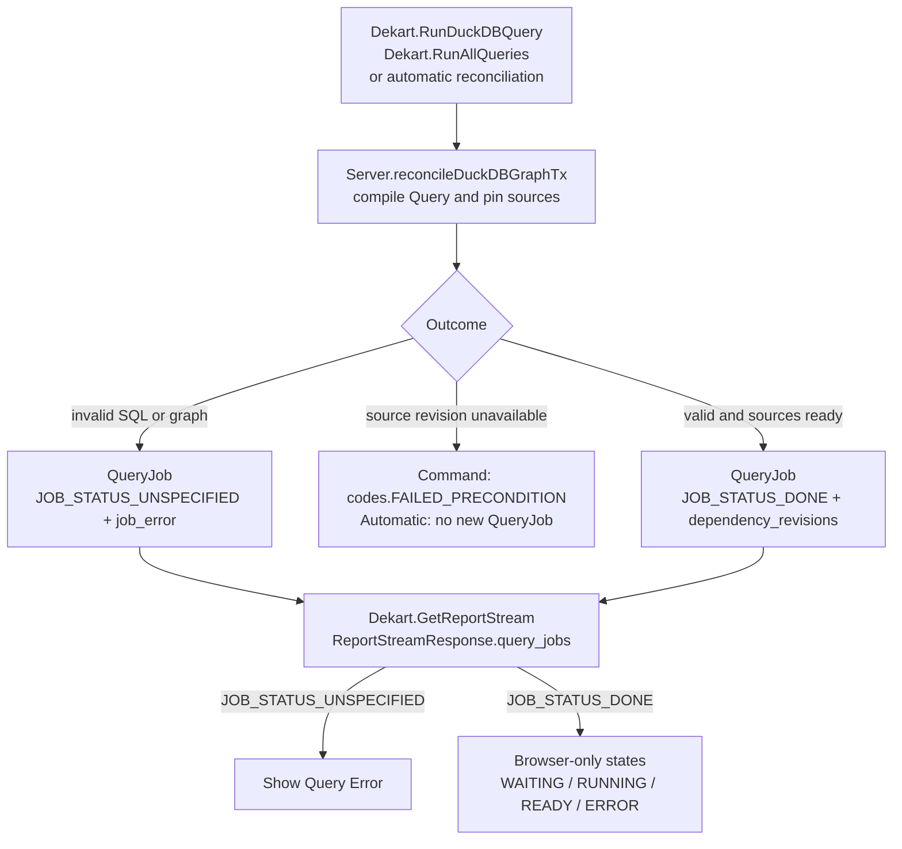
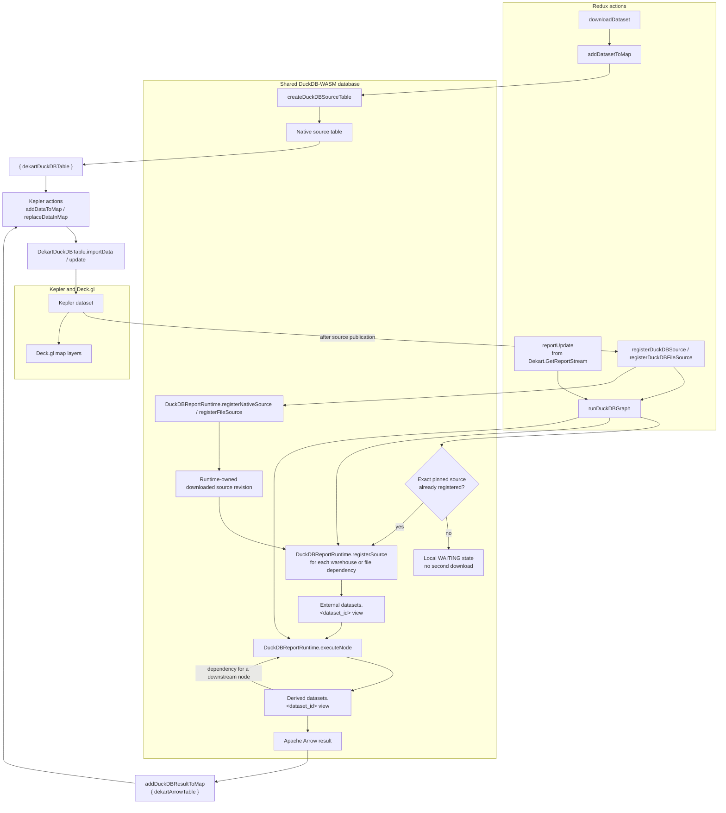

# DuckDB Architecture

## Status

Implemented design for the unshipped DuckDB feature. Its migrations may be
changed directly; no DuckDB compatibility layer is needed.

This document replaces the former connection-model, execution-command, and
server-graph-reconciliation documents.

## Goal

Introduce DuckDB as a browser execution engine with the smallest model that
fits Dekart:

- `Query` is the authoritative current SQL and server-derived dependency graph.
- `QueryJob` is the execution history: its existing `query_text` stores the SQL
  sent to DuckDB and dependency revisions pin the sources used by that execution.
- the server compiles SQL and reconciles shared jobs;
- the report stream publishes canonical shared state;
- each browser materializes streamed DuckDB jobs locally.

The design deliberately does not repair races, ordering limitations, restart
behavior, or compatibility gaps already present for connection-backed queries.
Those limitations are listed explicitly below instead of being hidden behind
DuckDB-specific infrastructure.

## Consolidation Map

| Removed working document | Concern retained here | Mechanisms rejected or deferred |
| --- | --- | --- |
| `duckdb-connection-model-design.md` | Query execution engine, null dataset connection, snapshot/fork engine semantics | sentinel connection, FK relaxation, virtual dataset connection, rolling DuckDB compatibility |
| `duckdb-query-execution-design.md` | single-purpose Execute, stream-owned shared state, browser-local materialization | graph-wide CAS, command IDs/receipts, unary job installation, accepted-definition state |
| `duckdb-server-graph-reconciliation-design.md` | server compiler, current Query graph, Run All/source reconciliation, exact dependency pins | activation RPC, job heads/revisions, schema/reconciliation versions, active-variant registry, restart queue, warehouse redesign |

The rejected mechanisms are listed in detail under **Hardening Explicitly Not
Included**. Inherited risks are listed separately under **Known Existing
Limitations and Tradeoffs**. The three source files were untracked working
documents and are removed by this consolidation; this table is their retained
decision inventory.

## Product Semantics

`Query.query_text` is current executable SQL, not a separate draft. Saving SQL
changes the authoritative Query. Explicit Execute reconciles it immediately;
the next automatic reconciliation may also execute a saved edit without another
Execute click. This is the accepted tradeoff that avoids a second definition
entity or accepted-definition pointer.

DuckDB executes in the browser, but its definition and job graph are shared.
All viewers materialize the same streamed QueryJob independently.

## Minimal Data Model

### Query execution engine

DuckDB is not a connection. Persist the runner on Query and Query snapshots:

```proto
enum QueryExecutionEngine {
  QUERY_EXECUTION_ENGINE_UNSPECIFIED = 0;
  QUERY_EXECUTION_ENGINE_CONNECTION = 1;
  QUERY_EXECUTION_ENGINE_DUCKDB = 2;
}
```

| Engine | `datasets.connection_id` | Meaning |
| --- | --- | --- |
| `CONNECTION` | connection UUID | Execute through that saved connection |
| `CONNECTION` | `NULL` | Preserve the existing system-connection behavior |
| `DUCKDB` | `NULL` | Accept jobs on the server and execute them in browsers |

The existing dataset-to-connection foreign key remains unchanged. There is no
DuckDB row in `connections`, no reserved connection ID, and no virtual
connection exception. Ordinary connection CRUD never sees DuckDB.

For pre-feature data, migrations set every existing Query and Query snapshot to
`CONNECTION`. New commands must persist an explicit non-zero engine.

### Query

A DuckDB Query stores only current definition state:

```text
query_text
execution_engine
duckdb_dependency_dataset_ids
duckdb_validation_error
```

The dependency IDs and validation error are server analysis outputs. Clients do
not submit them. Query does not store compiled execution SQL or ordered
parameter names, so there is no duplicated compiled state to synchronize with
`query_text`.

Snapshots copy user SQL and execution engine, not derived dependency metadata.
Restore and fork analyze that SQL against the restored or destination catalog;
derived state is cheap to rebuild and has no independent historical meaning.

### QueryJob

Reuse `QueryJob.query_text` for the exact SQL sent to the selected execution
engine. For a connection job it remains warehouse SQL. For a DuckDB job it is
server-compiled SQL containing stable dataset-ID references and deterministic
parameter tokens. The browser executes this field directly.

The only new persisted QueryJob data is `dependency_revisions`, which pins the
exact warehouse job, DuckDB job, or file source used by the execution.

The execution definition and pinned identities do not change to represent a
different execution. Existing lifecycle fields may still advance as a pending
source or result completes; this design does not replace the existing job state
machine with fully immutable status rows. For DuckDB, existing `DONE` means the
shared graph is ready for browser materialization; local reducer state records
whether that browser has actually executed it. A separate shared
`READY_FOR_BROWSER` status is not added.

Automatic reconciliation computes a canonical fingerprint in memory from the
desired compiled `query_text`, parameter hash, and dependency revisions.
It computes the same scalar fingerprint for the latest job; it does not persist
a job-key column or deeply compare mutable job objects:

- compare only with the latest job for the same Query and parameter hash;
- if the latest fingerprint matches, do nothing;
- otherwise append a new job, even if an older historical job has that
  fingerprint;
- explicit Execute always appends a fresh root job.

For a structurally invalid definition, the compiler returns a deterministic
non-executable artifact and validation error. Its fingerprint also includes that
structural error, and that invalid job is terminal rather than advanced by source
lifecycle handlers. Lifecycle errors on otherwise valid jobs are mutable status
and are excluded from the fingerprint; they cannot cause duplicate executions.

The latest job remains selected with Dekart's existing QueryJob ordering. This
design does not add a key/index, sequence column, or replacement ordering for
warehouse jobs.

#### DuckDB job flow and states



There are only two persisted DuckDB `QueryJob` outcomes:

- `QueryJob.JobStatus.JOB_STATUS_DONE`: the browser may materialize the job;
- `QueryJob.JobStatus.JOB_STATUS_UNSPECIFIED` with `job_error`: the definition
  is invalid and the browser shows Query Error.

An unavailable source rejects a command with `codes.FAILED_PRECONDITION`;
automatic reconciliation creates no new job. An unchanged automatic
reconciliation keeps the latest job; when no parameter hash has run yet, it
updates Query dependency analysis without creating a job. These no-op paths are
omitted from the diagram.

`DUCKDB_JOB_STATUS_WAITING_FOR_SOURCES`, `RUNNING`, `READY`, and `ERROR` are
browser-local constants, not protobuf states. DuckDB does not use protobuf
`JOB_STATUS_PENDING`, `JOB_STATUS_RUNNING`, or `JOB_STATUS_READING_RESULTS`
because materialization runs in the browser.

Code anchors: the RPC contract is in `proto/dekart.proto`; server reconciliation
and job insertion are `reconcileDuckDBGraphTx` and `insertDuckDBExecutionTx` in
`src/server/dekart/duckdbcommand.go`; browser state transitions are in
`src/client/actions/duckdb.js`.

### Dependency revisions

Query dependency IDs and QueryJob dependency revisions answer different
questions:

- `Query.duckdb_dependency_dataset_ids`: which datasets current SQL refers to;
- `QueryJob.dependency_revisions`: which exact result/source revisions one
  execution used.

Keep the revision structure minimal:

```proto
message QueryJobDependencyRevision {
  string dataset_id = 1;
  string query_job_id = 2;   // warehouse or DuckDB dependency
  string file_source_id = 3; // file dependency
}
```

The pinned QueryJob closure already carries its result ID and status, so those
values are not duplicated on the edge. A pending warehouse QueryJob is stable
enough to pin by ID. A warehouse dependency with no job for the current hash, or
a file without a stable `file_source_id`, is not. Execute or Run All rejects that
DuckDB job before mutation with visible `FAILED_PRECONDITION`; Run All first
accepts its normal warehouse jobs, and file completion lets a refresh-capable
user click **Run All** or re-apply parameters for current values. The UI shows
`File is ready; refresh queries to run dependent DuckDB queries`. Upload failure
remains visible through the existing File error. The reconciler resolves stable
pins before browser execution.

### Chosen DuckDB consistency invariants

Two retained choices are stronger than the guarantees of ordinary queries and
are intentional product behavior, not general hardening:

1. Query persists server-derived dependencies and validation so the report
   stream exposes one current graph/error state immediately after save and after
   reload, before an execution job exists. Catalog mutations update this read
   model from both the old and new dependency relationships.
2. QueryJob pins exact dependency revisions so every browser materializing the
   same chained job reads the same upstream execution. Without pins, a source
   refresh during browser execution could make viewers materialize different
   graphs under one shared QueryJob ID.

These fields are kept because they define the shared multi-viewer DuckDB product.
They are not used as a reason to retrofit equivalent history guarantees into
connection-backed query execution.

## Server Compiler

Add one server domain component, `src/server/duckdbsql`, that owns the SQL
contract formerly implemented by the client scanner. It uses DuckDB's native
parser, pinned to the same DuckDB version as DuckDB-WASM, to:

- accept exactly one read-only statement;
- reject mutating statements, internal schemas, and external readers;
- resolve `datasets."Label"` against the report dataset catalog;
- return deterministic dependency dataset IDs;
- rewrite dataset references to stable dataset-ID table names;
- rewrite parameters to deterministic token indexes based on report parameter
  names sorted canonically;
- return deterministic validation for missing/ambiguous labels and unsafe SQL.

The native parser serializes the transient AST without binding or executing the
submitted SQL. Dekart requires one SELECT, resolves `BASE_TABLE` nodes in the
`datasets` schema, and allows only the in-memory table functions in the contract
corpus. The AST is immediately deserialized into QueryJob SQL and is never
persisted. This leaves Dekart responsible only for its dataset and parameter
contract instead of maintaining a second DuckDB grammar or keyword blacklist.

The compiler returns two views of the same input:

```text
analysis persisted on Query: dependencies + validation
execution artifact persisted in QueryJob.query_text: compiled SQL
```

Port the existing JavaScript scanner corpus to the server compiler. Once parity
is proven, remove client graph-authority parsing; the browser must not maintain
a second shared dependency compiler.

SQL save analyzes the changed Query. Dataset add/remove/rename, query binding,
engine changes, parameter declarations, restore, and fork re-analyze affected
DuckDB Queries because those operations can change label or parameter
resolution. Reconciliation also analyzes locked current Query rows before using
their graph, so jobs are never built from client-supplied metadata.

## Commands and Queries

Read endpoints remain read-only. Canonical Query and QueryJob state reaches the
client through the existing report stream.

### `RunDuckDBQuery`

This is the explicit editor command:

```proto
message RunDuckDBQueryRequest {
  string query_id = 1;
  string query_text = 2;
  string query_params_values = 3;
  string expected_query_source_id = 4;
}

message RunDuckDBQueryResponse {}
```

The command uses the existing Query source identity for optimistic comparison,
saves and analyzes the submitted SQL, appends a fresh root job when every source
has a stable revision, and reconciles its DuckDB consumers for the current
parameter hash. A missing warehouse job or stable file revision rejects before
mutation. The empty response is only an acknowledgement; jobs arrive through
the report stream.

No graph-wide version or expected-current-job guard is added. Under the existing
report/query transaction, the server compiles against the current catalog and
pins the current source jobs.

### Existing commands

- Parameter Apply already dispatches Run All. Run All accepts its normal
  warehouse jobs, then invokes the same DuckDB reconciler for those parameter
  values. This remains the only way to create a new parameter hash without
  explicitly executing one DuckDB query.
- warehouse source acceptance/completion reconciles affected DuckDB consumers
  for that source job's parameter hash using the existing job lifecycle;
- file replacement reconciles parameter hashes already represented by current
  DuckDB jobs; after initial file completion, a refresh-capable user runs Run All
  or re-applies current values;
- UpdateQuery/UpdateReport store user SQL and server-derived analysis but do not
  accept compiled SQL or dependency metadata from the client.

Opening or reloading a report is read-only. The report stream returns jobs for
already-created parameter hashes and the browser materializes them. Public
viewers cannot create a new hash, matching the pre-DuckDB permission model.

Do not redesign warehouse `RunQuery`, external executor startup, file completion,
or report-stream transport as part of introducing DuckDB.

### API boundaries

The MCP runtime has no browser materializer, so MCP create/update/run commands
reject DuckDB at the endpoint boundary. Every DuckDB command performs the normal
report/workspace authorization check before loading or mutating graph state.

## Server Reconciliation

`reconcileDuckDBGraphTx` receives a caller-owned transaction, an already locked
report, an already validated `query_params_hash`, and an affected root set. It
never begins, commits, rolls back, or pings by itself. The command endpoint owns
this sequence:

```text
begin → lock report → lock Query rows in stable ID order
      → apply its source/definition mutation → reconcileDuckDBGraphTx
      → commit → ping
```

When a triggering source job was already committed under existing warehouse or
file lifecycle behavior, a small wrapper opens the report-locked transaction and
calls the same `...Tx` function. Run All retains its existing acceptance
boundaries and reconciles after accepted warehouse jobs; this design does not
make the complete external operation atomic.

RunDuckDBQuery and Run All canonicalize submitted values against the saved
report declarations and derive the hash before calling the reconciler. Trusted
source transitions, restore, and fork already operate on existing QueryJobs and
pass their stored hashes directly. A hash is an opaque identity; no path attempts
to reconstruct parameter values from it and no value registry is added.

Within the caller-owned transaction, the reconciler:

1. loads current Query rows and the report dataset catalog under the existing
   report-first/query lock order;
2. analyzes current DuckDB SQL and persists changed dependencies/validation;
3. builds the dependency graph and identifies cycles;
4. resolves exact warehouse, file, and already-created DuckDB source revisions;
5. walks affected DuckDB nodes dependency-first;
6. compiles each node once, derives its in-memory fingerprint, and compares it
   only with the latest job for that Query and parameter hash;
7. appends required jobs; invalid SQL or cycles use the existing failed-job
   representation (`JOB_STATUS_UNSPECIFIED` with `job_error`).

An acyclic downstream job pins the exact upstream job selected or appended in
the same reconciliation. Cycle members become invalid and downstream jobs pin
that current invalid state; they must not be made executable by falling back to
an older successful cycle member.

The affected set is intentionally small:

- explicit Execute: root plus its transitive consumers;
- Run All: the complete current DuckDB graph for one hash;
- source job transition: that source's transitive DuckDB consumers;
- definition/catalog change: changed Queries plus consumers from the old and new
  dependency relationships.

This is the only new shared orchestration pattern. It reuses existing report
transactions, QueryJob lifecycle, parameter hashing, stream pings, and source
result serving.

## Client Responsibilities

The client no longer parses SQL to establish shared graph state, sends
dependency metadata, ensures individual jobs, or installs unary DuckDB jobs.

It retains only:

- editor command pending state for immediate button/status feedback;
- canonical Query/QueryJob state from the report stream;
- a local per-job `waiting → running → ready | error` state machine in the
  reducer (not protobuf or database state);
- browser-local source registration, DuckDB-WASM execution, and Kepler publication;
- runtime generation, report identity, download identity, and canonical job ID
  checks protecting actual asynchronous browser work.

The materializer orders work from streamed `dependency_revisions`, constructs a
parameter table from all report parameters sorted by name, and executes the
compiled `QueryJob.query_text` without SQL parsing. A downstream node waits for
its upstream node to become locally ready; an upstream local error blocks that
branch and remains retryable on the next materialization pass. Publication is
allowed only while the streamed job remains current.

Editor dirty/Execute eligibility compares the visible editor text with current
`Query.query_text`/Query source identity. It never compares user SQL with
compiled `QueryJob.query_text`. Fork, restore, and history likewise obtain user
SQL from Query/snapshot state rather than treating job SQL as a user definition.

### DuckDB to Kepler data flow



`configureDuckDB` installs `DekartDuckDBTable` and the adapter returned by
`createSharedDuckDBAdapter` into Kepler's application configuration. Ordinary
sources reach Kepler as `dekartDuckDBTable` references to native tables. Derived
DuckDB results reach it as `dekartArrowTable` values. Both paths use the same
DuckDB-WASM database and the same Kepler publication actions. `downloadDataset`
is the only action that fetches `/dataset-source`; if the exact revision pinned
by a DuckDB job is not registered locally, `runDuckDBGraph` waits instead of
starting another download. A completed source registration reruns the affected
branch, while cancellation or download failure registers a source error and
reruns it into `Query Error`.

Code anchors: source publication is in `src/client/actions/dataset.jsx`; graph
materialization is in `src/client/actions/duckdb.js`; `DuckDBReportRuntime` is in
`src/client/lib/duckdb/runtime.js`; and the Kepler table integration is in
`src/client/lib/duckdb/table.js` and `src/client/lib/duckdb/applicationConfig.js`.

## Snapshot, Restore, and Fork

- snapshots store Query SQL and execution engine;
- restore makes the snapshot Query definition current and re-analyzes it. When
  parameter declarations are unchanged, it reconciles hashes represented by
  current jobs. When declarations changed, old hashes/jobs are not reused and a
  refresh-capable user must Apply/Run All with current values;
- fork copies Query SQL and engine, remaps datasets, and re-analyzes against the
  destination catalog. When warehouse connections remain reusable, it reconciles
  each source-report current hash directly into destination jobs. If any warehouse
  connection is remapped, it defers all DuckDB materialization until a new
  warehouse result or explicit DuckDB Execute supplies a destination revision;
- no accepted-definition pointer or DuckDB job history must be reconstructed.

Because DuckDB is unshipped, pending PostgreSQL and SQLite migrations may be
rewritten directly. Pre-feature Queries and Query snapshots are backfilled as
`CONNECTION`. No rolling DuckDB compatibility or reserved-ID conversion is
needed.

## Additions Kept After Minimality Review

| Addition | Why it is required for DuckDB |
| --- | --- |
| `Query.execution_engine` and snapshot copy | Distinguishes browser execution without pretending DuckDB is a connection |
| Query dependency IDs and validation | Chosen shared read-model invariant: one streamed current graph/error exists before execution |
| QueryJob dependency revisions | Chosen multi-viewer invariant: one shared chained job always identifies the same upstream executions |
| Server SQL compiler/reconciler | Removes the browser as authority for shared graph state |
| `RunDuckDBQuery` | Single-purpose explicit definition/execution command |
| Local DuckDB job state | Orders browser-only asynchronous work and blocks descendants after a local upstream failure; it is reducer state, not a shared contract |
| Shared native source tables | Lets the map and DuckDB consumers reuse one browser table instead of downloading and parsing the same source twice |

No other persistent entity or coordination mechanism is required.

## Hardening Explicitly Not Included

The following proposals are removed because they primarily cover failure modes
that existing connection-backed queries do not solve:

- placeholder DuckDB connection rows, relaxed connection foreign keys, or
  virtual-connection columns;
- `duckdb_query_definitions`, accepted-definition pointers, or DuckDB job-head
  tables;
- `job_revision` and a migration of all warehouse job ordering;
- `duckdb_graph_version_id` and graph-wide compare-and-set;
- `duckdb_reconciliation_revision` and command-to-stream acknowledgements;
- `query_params_schema_hash`; reuse the existing encoded parameter-values hash;
- `duckdb_execution_sql` or `duckdb_parameter_names`; reuse `QueryJob.query_text`
  and canonical report-parameter ordering;
- persisted `duckdb_job_key`; compare deterministic in-memory fingerprints of
  the desired and latest execution records;
- `JOB_STATUS_INVALID`; reuse `JOB_STATUS_UNSPECIFIED` with `job_error`;
- `READY_FOR_BROWSER`; for a DuckDB Query, existing `DONE` means shared server
  preparation is complete and local reducer state describes browser execution;
- protobuf `DuckDBJobStatus`; browser execution status is local reducer state;
- duplicated `job_result_id`/pending `file_id` dependency locators;
- command IDs, command receipts, request digests, or automatic transport retry;
- active-parameter registries, leases, eviction, or proactive reconciliation of
  inactive hashes;
- `ActivateDuckDBParameterVariant`; existing parameter Apply already invokes Run
  All, while report open/reload only reads previously created hashes;
- startup reconstruction of warehouse pollers or pending file work;
- process-epoch stream sequences or forced sequence-zero reconnects;
- a redesign of warehouse RunQuery parameters or unary responses;
- `Report.query_execution_engines` solely for a report-list badge; add such a
  derived projection later only with an explicit product requirement;
- a second accepted/draft SQL state;
- a background DuckDB reconciliation queue.

## Known Limitations and Tradeoffs

### Inherited limitations not addressed

Introducing DuckDB does not expand scope to repair these existing behaviors:

1. QueryJob current selection still relies on existing timestamp ordering.
   Equal database timestamps can make chronological intent ambiguous.
2. Report and dataset stream reconciliation keeps existing `updated_at` and ping
   behavior, including timestamp precision and lost/delayed-notification limits.
3. A command response lost after commit may leave the client uncertain and a
   repeated user action may create another job; no durable command receipt is
   added.
4. In-flight warehouse executors and caller-driven file completion keep their
   existing server-restart behavior; DuckDB adds no recovery scheduler.
5. Run All/external work keeps its existing acceptance and start boundaries; the
   full warehouse-plus-DuckDB operation is not redesigned as one atomic command.
6. The existing parameter-values hash is not a general future schema-version
   mechanism. If parameter types gain execution semantics, extend that shared
   hash contract then rather than adding DuckDB-only versioning now.
7. A catalog change racing an editor command is resolved against the catalog
   held by the server transaction; there is no graph-wide client-observed CAS.
8. Legacy queries shared by incompatible live dataset bindings remain ambiguous
   and may be rejected rather than normalized by this feature.
9. QueryJob history and parameter variants retain their existing storage and
   stream-growth characteristics for refresh-capable users.

### DuckDB-specific product tradeoffs

1. Saved SQL is current SQL and may execute on the next Run All or source
   reconciliation without a second Execute click.
2. Public viewers can materialize shared parameter hashes that already exist,
   but an unseen URL value shows no current result and a refresh-permission
   message until a refresh-capable user applies it through Run All.
3. Browser-local success, failure, and materialized tables are not canonical;
   viewers may fail independently and reload re-materializes streamed jobs.
4. Dekart intentionally supports a narrower set of table sources than DuckDB.
   The server and browser engines stay on the same DuckDB version, while
   fail-closed source policy and corpus tests cover their shared SQL contract.
5. Source lifecycle commands keep their existing transaction boundaries. The
   DuckDB `...Tx` reconciler composes where a caller transaction exists but does
   not make external warehouse/file work globally atomic.
6. Persisted Query analysis and exact dependency pins intentionally provide the
   shared multi-viewer guarantees described above; ordinary queries are not
   upgraded to match them.
7. Executing against a file before its source revision exists fails without a
   job. After upload finishes, the user must Run All or re-apply parameters; the
   feature does not retain parameter values for automatic retry.
8. A fork that remaps any warehouse connection invalidates all DuckDB jobs in the
   destination report, including independent file-backed or standalone branches.
   Those branches materialize on a later source transition or explicit Execute.
   Preserving them would require per-component fork reconciliation, which is not
   part of the minimal integration.

## Verification

Add tests only for behavior introduced or changed by DuckDB:

- pure compiler corpus parity for safe SQL, dataset labels, parameters, comments,
  external readers, table functions, pragmas, extensions, and malformed SQL;
- Query engine persistence with null DuckDB connection IDs on PostgreSQL and
  SQLite;
- explicit Execute appends a root job and reconciles exact descendants;
- repeated Run All/source reconciliation is idempotent against the latest job;
- repeated reconciliation remains idempotent before and after a valid job acquires a
  lifecycle error; mutable `job_error` does not define execution identity;
- saved SQL is used by the next Execute, Run All, or source reconciliation;
- QueryJob compiled SQL, canonical parameter binding, and dependency revisions
  are the exact artifact used by browser materialization;
- a compiled job whose dataset/parameter tokens differ from user SQL does not
  make the editor appear dirty; changing the editor Query does;
- parameter Apply/Run All, private-report authorization, known-hash public-viewer
  read behavior, invalid graphs/cycles, file sources,
  warehouse-to-DuckDB chains, reload, restore, and fork;
- browser-local upstream runtime failure blocks its dependent branch and a later
  materialization pass can retry it;
- Execute against a file without `file_source_id` fails visibly without creating
  a job; stored-file completion retries through Run All and upload failure
  remains visible;
- dataset rename/removal updates persisted Query analysis using both old and new
  dependency relationships, including missing-to-valid and valid-to-ambiguous
  label transitions;
- restore with unchanged parameter declarations reconciles existing hashes;
  restore with changed declarations ignores old hashes and waits for Apply/Run
  All, never reconstructing values from a hash;
- fork with reusable warehouse connections and several current hashes reconciles
  each hash directly under the copied parameter declarations without copying
  source-report dataset identities;
- explicit Execute, Run All, and source completion use caller-owned transaction
  boundaries and publish only committed shared jobs;
- client removal of per-query Ensure and client-authored graph metadata.

Use pure unit tests for the compiler. Cycle construction and every database,
stream, browser-runtime, permission, and user-visible behavior use DOM-level
Cypress. Run the complete DuckDB Cypress lane. The separately requested map
performance benchmark remains opt-in and is not a DuckDB correctness gate.

Do not add tests or implementation solely for the inherited limitations listed
above.

## Acceptance Criteria

- DuckDB is a Query execution engine and never a connection row.
- Query is the sole current user-SQL and server-derived graph definition.
- Query stores no compiled SQL or ordered parameter copy.
- QueryJob's existing SQL field records compiled DuckDB SQL and its dependency
  revisions record exact pinned sources.
- the server owns SQL analysis and whole-graph reconciliation.
- browsers submit parameter values, not graph metadata, and execute only streamed
  compiled jobs.
- no accepted-definition/head table, job revision, graph/reconciliation version,
  command receipt, schema hash, persisted job key, separate compiled-SQL or
  parameter-name field, invalid shared status, or active-variant registry exists.
- saved SQL may execute on the next automatic reconciliation trigger.
- existing non-DuckDB edge cases remain documented rather than expanded into
  DuckDB-specific hardening.
